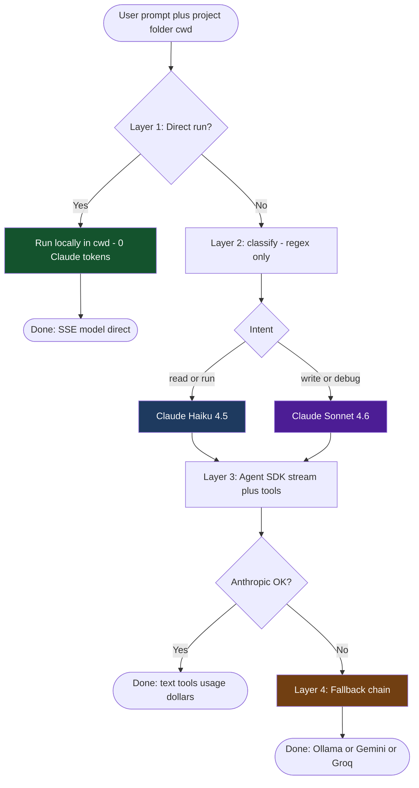
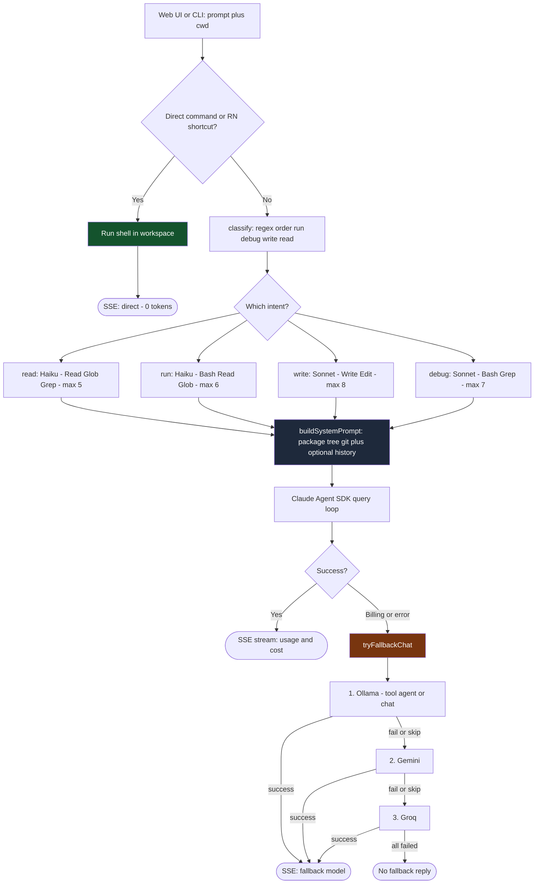
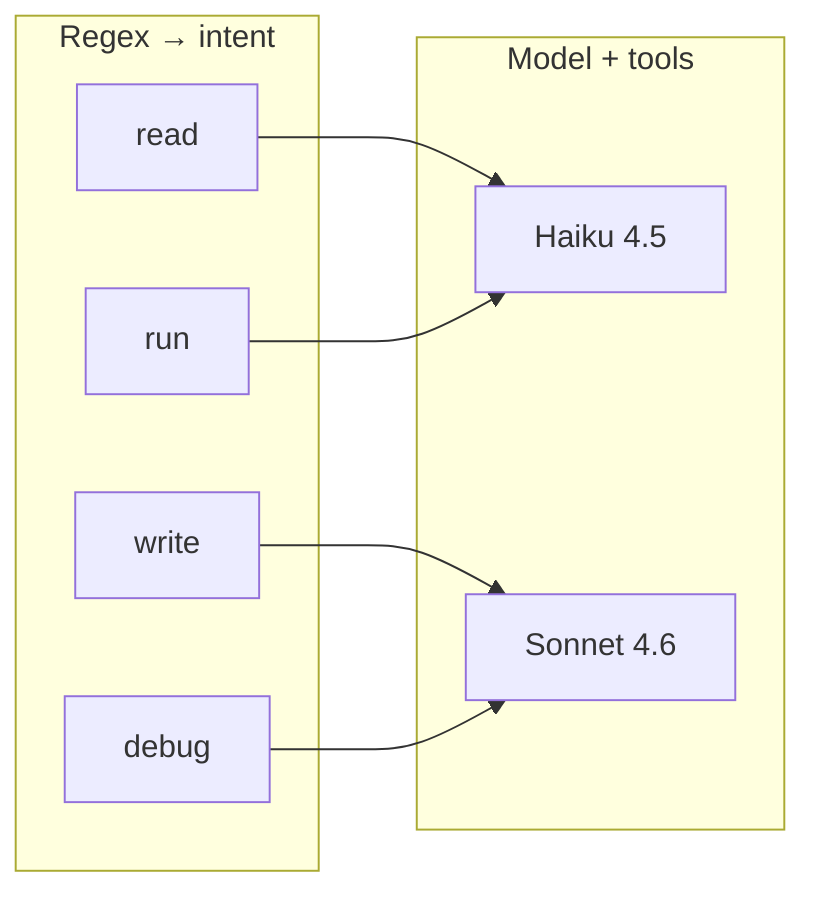

# Ultronios — AI Agent for React Native

> Your autonomous senior React Native engineer, powered by Claude.  
> Built by **coder-shubh** · Runs locally · Zero cloud data storage

Ultronios works on your behalf — opening files, running builds, writing code, debugging crashes, installing packages — anything a senior RN dev would do, fully autonomously.

---

## Features

- **Autonomous execution** — reads files, runs shell commands, writes and edits code without hand-holding
- **Intent-based model routing** — regex classifier picks **Haiku** (read/run) or **Sonnet** (write/debug); optional **direct** shell path (0 tokens)
- **~75% token cost reduction** — vs. naive single-model, full-context approaches
- **Streaming web UI** — Next.js chat interface with real-time token usage display
- **CLI mode** — terminal interface for headless / SSH use
- **Tool call visibility** — every Bash/Read/Write/Edit/Grep call shown in the UI
- **Prompt cache aware** — displays cache hits and actual USD cost per response

---

## Architecture

Ultronios is a **layered pipeline**: cheap paths run first, then Claude with the smallest model + tool set that fits the task, and only if Anthropic fails do **local/cloud fallbacks** take over.

### Presentation flowcharts (Mermaid)

Use these in slides: preview in VS Code / GitHub, or open **[mermaid.live](https://mermaid.live)** → paste → **Export SVG/PNG**.

#### 1) High-level — one slide overview



#### 2) Detailed — layers, routing, and fallbacks



> **Note:** Order is configurable via **`FALLBACK_ORDER`** (default `ollama,gemini,groq`). Ollama can use a **local tool agent** when `OLLAMA_TOOLS=1` and `cwd` is set.

#### 3) Claude routing matrix (compact)



### End-to-end request flow (web UI → `POST /api/agent`)

```
User message + cwd (+ optional history[])
     │
     ▼
┌─────────────────────────────────────────────────────────────────┐
│ 1) ZERO-TOKEN “direct run” (no Claude, no API cost)             │
│    If the prompt matches a safe shell command or a known RN      │
│    phrase (“run ios”, “install pods”, “npm install”, …), the     │
│    server runs it locally (macOS: Terminal.app via osascript;    │
│    else: `sh -c` in cwd). SSE reports model `direct`, 0 tokens.  │
└─────────────────────────────────────────────────────────────────┘
     │ (no match)
     ▼
┌─────────────────────────────────────────────────────────────────┐
│ 2) INTENT CLASSIFIER — `classify()`                             │
│    Regex-only keyword patterns (no LLM call). Order: run →      │
│    debug → write → read. Defaults: path-like text → write;       │
│    else → read (cheaper default).                               │
│    Intents: read | run | write | debug                            │
└─────────────────────────────────────────────────────────────────┘
     │
     ▼
┌─────────────────────────────────────────────────────────────────┐
│ 3) CLAUDE AGENT (Anthropic Agent SDK)                            │
│    System prompt = `buildSystemPrompt(cwd, history)`             │
│    • Injects **project context** from disk: package.json, deps,  │
│      shallow file tree, git branch + last commits, Node version. │
│    • Optional **conversation snippet**: last 8 turns, each      │
│      truncated (~500 chars) to keep context small.                │
│    • Per-intent **model**, **allowedTools**, **maxTurns** (see   │
│      table below).                                               │
│    Streams: text, tool_use, usage (incl. cache read/write, $).  │
└─────────────────────────────────────────────────────────────────┘
     │ billing / quota / API error text / thrown error
     ▼
┌─────────────────────────────────────────────────────────────────┐
│ 4) FALLBACK CHAIN (`tryFallbackChat`) — no Anthropic credits    │
│    Order: `FALLBACK_ORDER` (default **ollama → gemini → groq**). │
│    • **Ollama** (local): if `OLLAMA_TOOLS=1` and `cwd` set,      │
│      runs **tool agent** (`ollamaAgent.ts`): read/write/edit,   │
│      glob, grep, run_command under workspace. Model pick:        │
│      `OLLAMA_MODEL` OR `OLLAMA_CODER_MODEL` for write/debug,     │
│      `OLLAMA_CHAT_MODEL` for read/run. Else: plain chat API.     │
│    • **Gemini** / **Groq**: chat-only, no project tools.         │
│    UI shows provider:model; Ollama tool steps map to tool cards. │
└─────────────────────────────────────────────────────────────────┘
```

### Claude routing (after classifier)

| Intent | Typical triggers | Model | Allowed tools | maxTurns |
|--------|------------------|-------|---------------|----------|
| **read** | open, show, explain, find, what, how… | `claude-haiku-4-5` | Read, Glob, Grep | 5 |
| **run** | run, build, install, metro, test, lint… | `claude-haiku-4-5` | Bash, Read, Glob | 6 |
| **write** | create, add, edit, refactor, implement… | `claude-sonnet-4-6` | Read, Write, Edit, Glob, Grep | 8 |
| **debug** | fix, crash, error, broken, why, slow… | `claude-sonnet-4-6` | Read, Glob, Grep, Bash | 7 |

Approximate **input** pricing (check Anthropic for current rates): Haiku tier ≈ **$1 / MTok**, Sonnet tier ≈ **$3 / MTok** — so routing “read/run” to Haiku avoids Sonnet/Opus cost for simple work.

### How we keep token use low

| Technique | What it does |
|-------------|----------------|
| **Regex classifier** | Picks intent without spending tokens on a separate LLM call. |
| **Smaller models for easy intents** | Haiku for read/run; Sonnet for write/debug only. |
| **Minimal tool sets** | Each intent exposes only the tools it needs (fewer tool definitions in context). |
| **Turn caps** | `maxTurns` per intent stops long agent loops vs. a single huge max. |
| **Tight system prompt** | Short rules + structured project block; avoids dumping whole repos. |
| **History cap** | When `history` is passed to the API, only the **last 8 turns** are serialized, truncated. |
| **Prompt cache** | Anthropic prompt cache (when applicable) — UI shows cache read/write tokens. |
| **Direct execution** | Recognized shell / RN phrases run without calling Claude (**0 tokens**). |

> **Note:** The bundled **web chat** currently sends `{ prompt, cwd }` per request. The API also accepts **`history`** for multi-turn system context; wiring the UI to pass prior messages is optional.

### When there are “no tokens” / Claude is unavailable

1. **Direct path** — still works for matching commands (0 tokens).
2. **Fallbacks** — configure at least one of:
   - **Ollama** locally (`OLLAMA_BASE_URL`, models via `OLLAMA_MODEL` / `OLLAMA_CODER_MODEL` / `OLLAMA_CHAT_MODEL`; disable tools with `OLLAMA_TOOLS=0`).
   - **Gemini** — `GEMINI_API_KEY`, optional `GEMINI_MODEL`.
   - **Groq** — `GROQ_API_KEY`, optional `GROQ_MODEL`.
3. If nothing succeeds, the user sees an error telling them to install Ollama or set API keys.

---

## Cost Profile (Claude path)

| Intent | Trigger keywords | Model | Input $/1M (approx.) |
|--------|------------------|-------|----------------------|
| `read` | open, show, find, explain, search | Haiku 4.5 | ~$1 |
| `run` | run, start, build, install, deploy | Haiku 4.5 | ~$1 |
| `write` | create, add, refactor, edit, modify | Sonnet 4.6 | ~$3 |
| `debug` | fix, error, crash, broken, why is | Sonnet 4.6 | ~$3 |

---

## Project Structure

```
ai-agent/
├── src/
│   └── index.ts              # CLI — agent loop, cwd, history file
├── web/
│   ├── app/
│   │   ├── page.tsx          # Landing (intro)
│   │   ├── chat/page.tsx     # Chat shell → ChatApp
│   │   ├── dashboard/page.tsx# Usage analytics (localStorage sessions)
│   │   ├── layout.tsx
│   │   ├── globals.css
│   │   └── api/
│   │       ├── agent/route.ts # SSE: classify → Claude | direct | fallback
│   │       └── projects/route.ts
│   ├── components/
│   │   ├── ChatApp.tsx       # Sessions, SSE client, export, mobile sidebar
│   │   ├── Sidebar.tsx       # History + projects + workspace path
│   │   ├── MessageList.tsx   # Markdown, tools, usage badges
│   │   ├── ChatInput.tsx     # Composer, quick actions, stop
│   │   ├── LandingPage.tsx
│   │   └── landing/          # Three.js starfield / sunny scene
│   └── lib/
│       ├── systemPrompt.ts   # buildSystemPrompt, project context
│       ├── fallbackLlm.ts    # Ollama / Gemini / Groq
│       ├── ollamaAgent.ts    # Local tool loop when Ollama fallback runs
│       ├── history.ts        # Browser session persistence
│       ├── analytics.ts      # Dashboard aggregates
│       └── types.ts
├── .env.example
├── package.json
└── README.md
```

---

## Prerequisites

| Requirement | Version |
|-------------|---------|
| Node.js | ≥ 20 |
| npm | ≥ 10 |
| Anthropic API key | [console.anthropic.com](https://console.anthropic.com) |

---

## Setup

### 1. Clone / open the project

```bash
cd /path/to/ai-agent
```

### 2. Install dependencies

```bash
# Root (CLI)
npm install

# Web UI
cd web && npm install && cd ..
```

### 3. Set your API key

```bash
cp .env.example .env
```

Edit `.env`:

```env
ANTHROPIC_API_KEY=sk-ant-...
```

---

## Usage

### Web UI (recommended)

```bash
npm run web
```

Open **http://localhost:3001**

#### UI Features

| Element | Description |
|---------|-------------|
| Sidebar | Switch between your RN projects with one click |
| Tool cards | Collapsible — shows every Bash/Read/Write/Edit call |
| Usage badge | Model · intent · ↑ input · ↓ output · ∑ total · ⚡ cache · $cost |
| Copy button | Hover any message to copy |
| Shift+Enter | New line in input; Enter to send |

### CLI

```bash
npm start
```

```
Ultronios  read→haiku  run→haiku  write→sonnet  debug→sonnet

cwd <path>  exit

› open HomeScreen.tsx
[haiku] Here's the file content...

› fix the crash on Android when navigating back
[sonnet] The issue is in...

› cwd /path/to/your/project
→ /path/to/your/project
```

#### CLI Commands

| Command | Effect |
|---------|--------|
| `cwd <path>` | Set working directory for all subsequent tasks |
| `exit` / `quit` | Stop the agent |
| Any natural language | Runs as a task |

---

## Example Prompts

```
# Files
open src/screens/HomeScreen.tsx
find all usages of AsyncStorage
show me the navigation structure

# Builds
run the iOS build
start Metro with cache reset
install pods

# Code
create a product listing screen with FlatList
add Redux slice for cart management
refactor the auth flow to use RTK Query

# Debug
fix the TypeError on line 42 in CartScreen
why is my FlatList re-rendering on every scroll
debug the Android back-press crash
```

---

## Your Projects

Ultronios has **no hardcoded paths**. Projects are discovered dynamically:

**Web UI** — click the folder icon in the sidebar, paste any workspace root (e.g. `/home/you/projects`), and Ultronios scans it for React Native / Node projects automatically.

**CLI** — type `cwd <path>` at the prompt to switch to any directory:
```
cwd /path/to/your/project
```

The agent reads `package.json`, `tsconfig.json`, file tree, and git history from whatever directory you point it at — no configuration needed.

---

## Tech Stack

| Layer | Technology |
|-------|-----------|
| Primary AI | Anthropic Claude (**Haiku 4.5** / **Sonnet 4.6** via agent router) |
| Fallbacks | Ollama (local + optional tools), Gemini, Groq |
| Agent SDK | `@anthropic-ai/claude-agent-sdk` |
| Web framework | Next.js 14 (App Router) |
| Styling | Tailwind CSS |
| Markdown | react-markdown + remark-gfm |
| Syntax highlighting | react-syntax-highlighter (VS Code Dark+) |
| Landing (optional) | three.js + React Three Fiber |
| CLI runtime | tsx + Node.js 20 |
| Language | TypeScript (strict) |

---

## Token Optimization (summary)

Design goals: **small system prompt**, **Haiku where possible**, **fewer tools in context**, **bounded turns**, **optional short history**, **direct-run when safe**.

- **Per-intent models** — read/run → Haiku; write/debug → Sonnet (see architecture table). No “everything via largest model” path in the default router.
- **Minimal tools per intent** — the SDK only receives the tool list for that intent (smaller definitions, less drift).
- **Turn caps** — `maxTurns` is 5–8 depending on intent, not an open-ended loop.
- **Project context once** — `readProjectContext` adds a bounded snapshot (scripts, deps, shallow tree, git), not the whole repo.
- **History trimming** — when the API receives `history`, only the **last 8** turns are embedded, each **truncated** to limit growth.
- **Direct execution** — matching commands skip the LLM entirely (**0** billed tokens for that request).

Rough **illustrative** comparison vs. a naive “always strongest model + all tools + high turn limit” setup:

| Factor | Naive baseline | Ultronios-style routing |
|--------|----------------|---------------------------|
| Simple “read file” style task | Expensive model + many tools | Haiku + Read/Glob/Grep + low maxTurns |
| Shell-like command | Full agent | Often **direct** (0 tokens) or Haiku + Bash |
| History | Unbounded | Capped / optional in API |

Exact dollar savings depend on your traffic and Anthropic pricing; the **architecture** is what enforces the cap.

---

## Development

```bash
# Run CLI in watch mode (auto-restarts on file save)
npm run dev

# Build web for production
npm run web:build

# Type check
npx tsc --noEmit
cd web && npx tsc --noEmit
```

---

## Security

- API key is loaded from `.env` — never committed to git
- `.env` is in `.gitignore`
- `permissionMode: "acceptEdits"` — file edits are auto-accepted; Bash commands may prompt depending on OS permissions
- The agent only operates within the configured `cwd`
- For the web API route, set `AGENT_API_TOKEN` and send it as `x-agent-token` to protect `/api/agent`

---

## Built by coder-shubh

> We build the tools that navigate uncharted territory.

---

## License

MIT © coder-shubh
